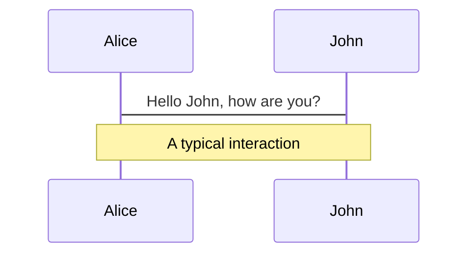
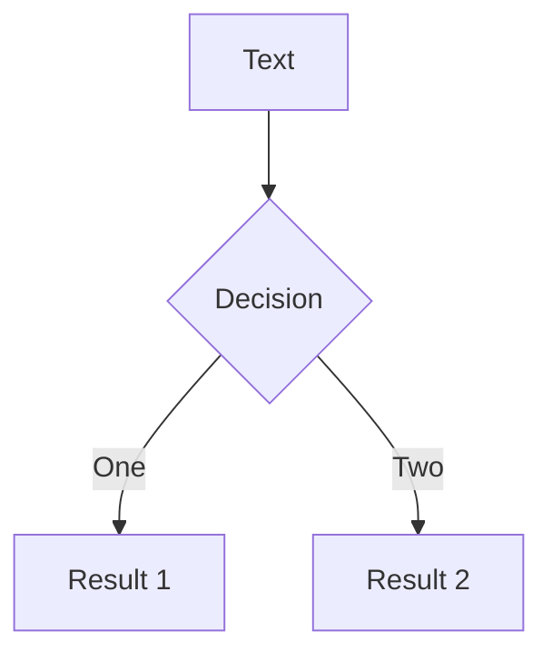
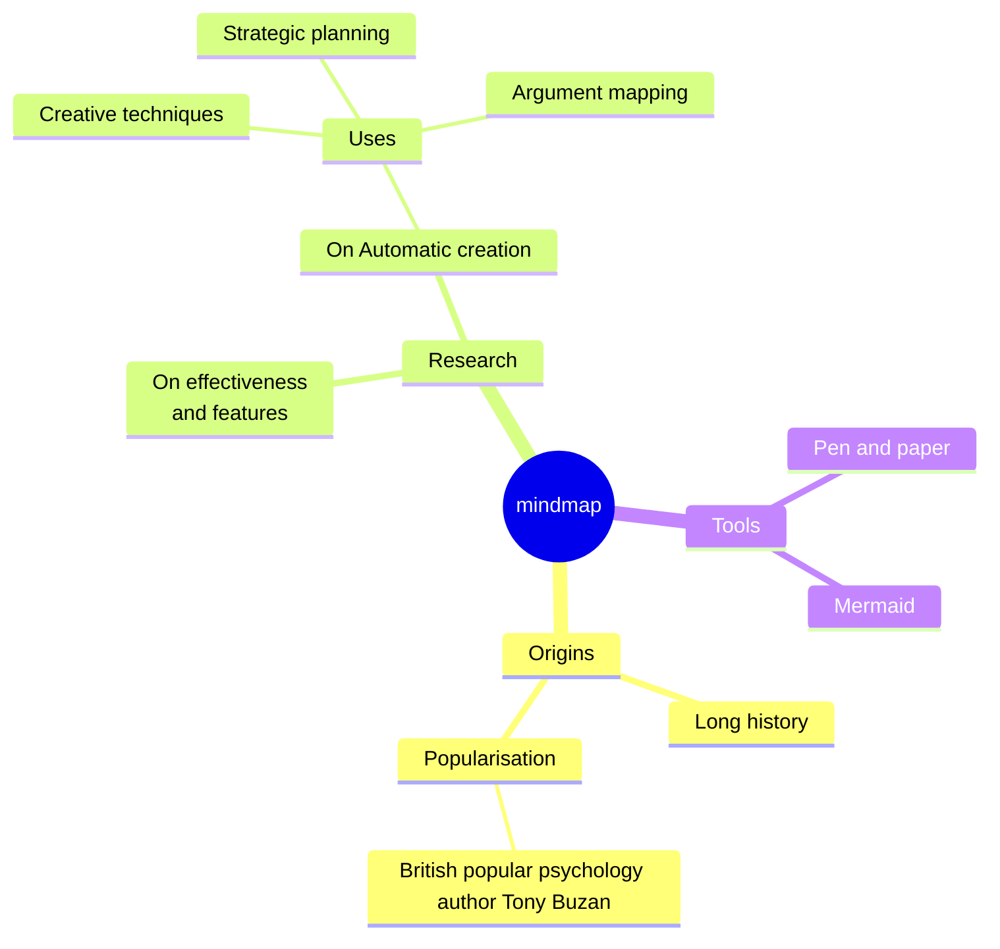
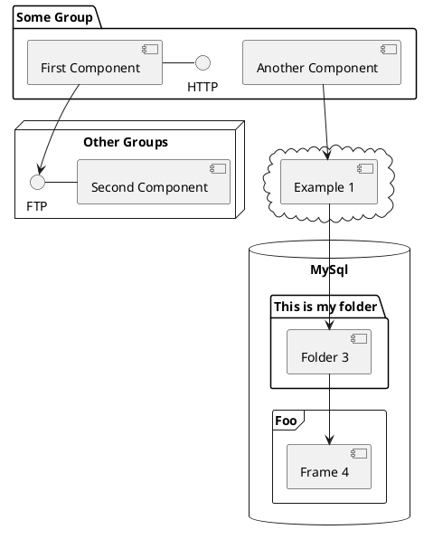

---
# try also 'default' to start simple
theme: seriph
# random image from a curated Unsplash collection by Anthony
# like them? see https://unsplash.com/collections/94734566/slidev
# some information about your slides, markdown enabled
title: Clearscale Summit 2024 AI in Software Development Workshop
info: |
  ## Clearscale Summit 2024 AI in Software Development Workshop
  Presentation slides and accompanying resources for the AI in Software Development workshop at the Clearscale Summit 2024.

# apply any unocss classes to the current slide
class: text-center
# https://sli.dev/custom/highlighters.html
highlighter: shiki
# https://sli.dev/guide/drawing
drawings:
  persist: false
# slide transition: https://sli.dev/guide/animations#slide-transitions
transition: slide-left
# enable MDC Syntax: https://sli.dev/guide/syntax#mdc-syntax
mdc: true
---

# AI in Software Development Workshop

## Or, How I Outsourced My Job to AI and Still Got Paid

---

## Agenda

- Introduction
- Understanding of AI tools and technologies
- Practical demonstrations
- Addressing Challenges and Mitigating Risks
- The Future of AI in Software Development
- Q&amp;A Session
- Closing Remarks and Resources

<!--
- Welcome, my name is Alexey Grigorovich and I will be your host today for the AI in Software Development workshop.
- The goal of this talk is to provide you with an understanding of AI tools and technologies, practical demonstrations, addressing challenges and mitigating risks, the future of AI in software development, and a Q&amp;A session.
-->

---

## Introduction to Modern AI in Software Development

A brief timeline of AI advancements:

<v-clicks>

- Transformers paper by Vaswani et al. in 2017, kicking off the transformer revolution
- GPT-2 published by OpenAI in 2019
- GitHub Copilot beta released by GitHub in 2021
- GPT-3.5 published by OpenAI in 2022, marking first practical use of AI in software development
- ChatGPT published by OpenAI in 2023, enabling conversational AI for the people
- ChatGPT 4.0 released by OpenAI in 2023, increasing the capabilities of conversational AI
- Google Gemini released by Google in late 2023

</v-clicks>

---

## Introduction to Modern AI in Software Development

Evolution in AI tools in software development

<v-clicks>

- code completion and generation (e.g. GitHub Copilot, AWS CodeWhisperer aka Q Developer)
- code suggestions and refactoring (e.g. GitHub Copilot Chat)
- code review (AWS CodeGuru)
- code search and completions (SourceGraph Cody)

</v-clicks>

---

# Practical Demonstrations

---

## Prerequisites

For the workshop, we recommend having the following tools and accounts ready:

- Google Gemini account
- Optionally, OpenAI ChatGPT account
- Code editor and language runtimes, or
- an online playground (such as repl.it)

We'll be using examples in Python, Javascript and some other languages throughout the workshop; feel free to follow along or just watch.

---

## Task 1: Basic code generation

Let's start with something simple. We'll ask the AI to generate a simple "Hello, World!" program in Python:

<v-clicks>

```md
Write a Python program that prints 'Hello, World!' to the console.
```

</v-clicks>

<v-clicks>

Output:

> Here's a Python program that prints "Hello, World!" to the console:
>
> ```python
> print("Hello, World!")
> ```
>
> This program uses the `print` function, which is a built-in function in Python
> that outputs the given message to the console. The message you want to print is
> enclosed in quotation marks.

</v-clicks>

<v-clicks>

This is not terribly useful, is it? Why don't we try something more exotic, shall we?

</v-clicks>

<!--

Prompt: Ask the AI to generate a simple "Hello, World!" program in Python.

Objective: Familiarize with basic command prompts for code generation.

Expected Output from AI: A simple Python script.

Evaluation Criteria: Correct syntax, successful execution printing "Hello, World!".

Note: see how modern models have been trained to follow instructions and generate code snippets based on the input prompt.

-->

---

## Task 1: Basic code generation

Let's check if the AI can generate a "Hello, World" in an esoteric language like Brainfuck:

<v-clicks>

```md
Write a Brainfuck program that prints 'Hello, World!' to the console.
```

</v-clicks>

<v-clicks>

Output:

> Brainfuck is an esoteric programming language designed to challenge and amuse > programmers, and not for practical use. Its simplicity in the design, > consisting of only eight commands, belies the complexity of the programs it > can execute. Writing "Hello, World!" in Brainfuck involves manipulating the > memory tape to store the ASCII values of the characters in "Hello, World!" and > then printing them. Here's a Brainfuck program that does just that:
>
> ```text
> >+++++++++[<++++++++>-]<.>+++++++[<++++>-]<+.+++++++..+++.>>>++++++++[<++++>-]
> <.>>>++++++++++[<+++++++++>-]<---.<<<<.+++.------.--------.>>+.>++++++++++.
> ```
>
> Each command in Brainfuck does the following:
>
> - `>` increment the data pointer (to point to the next cell to the right).
> - `<` decrement the data pointer (to point to the next cell to the left).
> - `+` increment (increase by one) the byte at the data pointer.
> - `-` decrement (decrease by one) the byte at the data pointer.
> - `.` output the byte at the data pointer.
> - `,` accept one byte of input, storing its value in the byte at the data > pointer.
> - `[` if the byte at the data pointer is zero, then instead of moving the > instruction pointer forward to the next command, jump it forward to the > command after the matching `]` command.
> - `]` if the byte at the data pointer is nonzero, then instead of moving the > instruction pointer forward to the next command, jump it back to the command > after the matching `[` command.
>
> This program initializes cells with the ASCII values corresponding to the letters in "Hello, World!", and then prints them one by one.

</v-clicks>

---

## Task 1: Basic code generation

I happen to have a Brainfuck compiler on my machine, which I'm going to use to test that code. You could also use an online interpreter such as (https://me.pocke.me/brainfuck-playground/):

```bash
$ cat >hello.bf <<EOF
>+++++++++[<++++++++>-]<.>+++++++[<++++>-]<+.+++++++..+++.>>>++++++++[<++++>-]
<.>>>++++++++++[<+++++++++>-]<---.<<<<.+++.------.--------.>>+.>++++++++++.
EOF
$ bfc hello.bf
$ ./hello
Hello World!
```

---

## Task 1: Basic code generation

Another example: z80 assembly language

<v-clicks>

Prompt:

```md
Write a program in z80 assembly language that prints "Hello, World" to the
standard output, assuming MSX-2 machine architecture
```

</v-clicks>

<v-clicks>

Output (abridged):

```asm {all}{maxHeight:'200px'}
        org     100h            ; Origin address, standard for MSX DOS .COM programs

start:
        ld      hl, msg         ; Load address of the message into HL
nextchar:
        ld      a, (hl)         ; Load the character pointed by HL into A
        or      a               ; Logical OR A with itself to check if it's the null terminator (0)
        jp      z, finished     ; If zero, we've hit the end of the string, jump to finished
        call    0A2h            ; Call CHPUT routine of MSX BIOS to print > aracter in A
        inc     hl              ; Move to the next character in the string
        jp      nextchar        ; Jump back to print the next character

finished:
        ret                     ; Return to MSX-DOS

msg:    db      'Hello, World!', 0 ; Null-terminated string

        end     start           ; End of the program, with start as entry int
```

</v-clicks>

---

transition: slide-up
level: 2

---

# Navigation

Hover on the bottom-left corner to see the navigation's controls panel, [learn more](https://sli.dev/guide/navigation.html)

## Keyboard Shortcuts

|                                                    |                             |
| -------------------------------------------------- | --------------------------- |
| <kbd>right</kbd> / <kbd>space</kbd>                | next animation or slide     |
| <kbd>left</kbd> / <kbd>shift</kbd><kbd>space</kbd> | previous animation or slide |
| <kbd>up</kbd>                                      | previous slide              |
| <kbd>down</kbd>                                    | next slide                  |

<!-- https://sli.dev/guide/animations.html#click-animations -->


<p v-after class="absolute bottom-23 left-45 opacity-30 transform -rotate-10">Here!</p>

---

layout: two-cols
layoutClass: gap-16

---

# Table of contents

You can use the `Toc` component to generate a table of contents for your slides:

```html
<Toc minDepth="1" maxDepth="1"></Toc>
```

The title will be inferred from your slide content, or you can override it with `title` and `level` in your frontmatter.

::right::

<Toc v-click minDepth="1" maxDepth="2"></Toc>

---

layout: image-right
image: https://cover.sli.dev

---

# Code

Use code snippets and get the highlighting directly, and even types hover![^1]

```ts {all|5|7|7-8|10|all} twoslash
// TwoSlash enables TypeScript hover information
// and errors in markdown code blocks
// More at https://shiki.style/packages/twoslash

import { computed, ref } from "vue";

const count = ref(0);
const doubled = computed(() => count.value * 2);

doubled.value = 2;
```

<arrow v-click="[4, 5]" x1="350" y1="310" x2="195" y2="334" color="#953" width="2" arrowSize="1" />

<!-- This allow you to embed external code blocks -->

<<< @/snippets/external.ts#snippet

<!-- Footer -->

[^1]: [Learn More](https://sli.dev/guide/syntax.html#line-highlighting)

<!-- Inline style -->
<style>
.footnotes-sep {
  @apply mt-5 opacity-10;
}
.footnotes {
  @apply text-sm opacity-75;
}
.footnote-backref {
  display: none;
}
</style>

<!--
Notes can also sync with clicks

[click] This will be highlighted after the first click

[click] Highlighted with `count = ref(0)`

[click:3] Last click (skip two clicks)
-->

---

## level: 2

# Shiki Magic Move

Powered by [shiki-magic-move](https://shiki-magic-move.netlify.app/), Slidev supports animations across multiple code snippets.

Add multiple code blocks and wrap them with <code>````md magic-move</code> (four backticks) to enable the magic move. For example:

````md magic-move
```ts {*|2|*}
// step 1
const author = reactive({
  name: "John Doe",
  books: [
    "Vue 2 - Advanced Guide",
    "Vue 3 - Basic Guide",
    "Vue 4 - The Mystery",
  ],
});
```

```ts {*|1-2|3-4|3-4,8}
// step 2
export default {
  data() {
    return {
      author: {
        name: "John Doe",
        books: [
          "Vue 2 - Advanced Guide",
          "Vue 3 - Basic Guide",
          "Vue 4 - The Mystery",
        ],
      },
    };
  },
};
```

```ts
// step 3
export default {
  data: () => ({
    author: {
      name: "John Doe",
      books: [
        "Vue 2 - Advanced Guide",
        "Vue 3 - Basic Guide",
        "Vue 4 - The Mystery",
      ],
    },
  }),
};
```

Non-code blocks are ignored.

```vue
<!-- step 4 -->
<script setup>
const author = {
  name: "John Doe",
  books: [
    "Vue 2 - Advanced Guide",
    "Vue 3 - Basic Guide",
    "Vue 4 - The Mystery",
  ],
};
</script>
```
````

---

# Components

<div grid="~ cols-2 gap-4">
<div>

You can use Vue components directly inside your slides.

We have provided a few built-in components like `<Tweet/>` and `<Youtube/>` that you can use directly. And adding your custom components is also super easy.

```html
<Counter :count="10" />
```

<!-- ./components/Counter.vue -->
<Counter :count="10" m="t-4" />

Check out [the guides](https://sli.dev/builtin/components.html) for more.

</div>
<div>

```html
<Tweet id="1390115482657726468" />
```

<Tweet id="1390115482657726468" scale="0.65" />

</div>
</div>

<!--
Presenter note with **bold**, *italic*, and ~~striked~~ text.

Also, HTML elements are valid:
<div class="flex w-full">
  <span style="flex-grow: 1;">Left content</span>
  <span>Right content</span>
</div>
-->

---

## class: px-20

# Themes

Slidev comes with powerful theming support. Themes can provide styles, layouts, components, or even configurations for tools. Switching between themes by just **one edit** in your frontmatter:

<div grid="~ cols-2 gap-2" m="t-2">

```yaml
---
theme: default
---
```

```yaml
---
theme: seriph
---
```


</div>

Read more about [How to use a theme](https://sli.dev/themes/use.html) and
check out the [Awesome Themes Gallery](https://sli.dev/themes/gallery.html).

---

# Clicks Animations

You can add `v-click` to elements to add a click animation.

<div v-click>

This shows up when you click the slide:

```html
<div v-click>This shows up when you click the slide.</div>
```

</div>

<br>

<v-click>

The <span v-mark.red="3"><code>v-mark</code> directive</span>
also allows you to add
<span v-mark.circle.orange="4">inline marks</span>
, powered by [Rough Notation](https://roughnotation.com/):

```html
<span v-mark.underline.orange>inline markers</span>
```

</v-click>

<div mt-20 v-click>

[Learn More](https://sli.dev/guide/animations#click-animations)

</div>

---

# Motions

Motion animations are powered by [@vueuse/motion](https://motion.vueuse.org/), triggered by `v-motion` directive.

```html
<div
  v-motion
  :initial="{ x: -80 }"
  :enter="{ x: 0 }"
  :click-3="{ x: 80 }"
  :leave="{ x: 1000 }"
>
  Slidev
</div>
```

<div class="w-60 relative">
  <div class="relative w-40 h-40">
    
    
    
  </div>

  <div
    class="text-5xl absolute top-14 left-40 text-[#2B90B6] -z-1"
    v-motion
    :initial="{ x: -80, opacity: 0}"
    :enter="{ x: 0, opacity: 1, transition: { delay: 2000, duration: 1000 } }">
    Slidev
  </div>
</div>

<!-- vue script setup scripts can be directly used in markdown, and will only affects current page -->
<script setup lang="ts">
const final = {
  x: 0,
  y: 0,
  rotate: 0,
  scale: 1,
  transition: {
    type: 'spring',
    damping: 10,
    stiffness: 20,
    mass: 2
  }
}
</script>

<div
  v-motion
  :initial="{ x:35, y: 30, opacity: 0}"
  :enter="{ y: 0, opacity: 1, transition: { delay: 3500 } }">

[Learn More](https://sli.dev/guide/animations.html#motion)

</div>

---

# LaTeX

LaTeX is supported out-of-box powered by [KaTeX](https://katex.org/).

<br>

Inline $\sqrt{3x-1}+(1+x)^2$

Block

$$
{1|3|all}
\begin{array}{c}

\nabla \times \vec{\mathbf{B}} -\, \frac1c\, \frac{\partial\vec{\mathbf{E}}}{\partial t} &
= \frac{4\pi}{c}\vec{\mathbf{j}}    \nabla \cdot \vec{\mathbf{E}} & = 4 \pi \rho \\

\nabla \times \vec{\mathbf{E}}\, +\, \frac1c\, \frac{\partial\vec{\mathbf{B}}}{\partial t} & = \vec{\mathbf{0}} \\

\nabla \cdot \vec{\mathbf{B}} & = 0

\end{array}
$$

<br>

[Learn more](https://sli.dev/guide/syntax#latex)

---

# Diagrams

You can create diagrams / graphs from textual descriptions, directly in your Markdown.

<div class="grid grid-cols-4 gap-5 pt-4 -mb-6">









</div>

[Learn More](https://sli.dev/guide/syntax.html#diagrams)

---

foo: bar
dragPos:
square: 691,33,167,\_,-16

---

# Draggable Elements

Double-click on the draggable elements to edit their positions.

<br>

###### Directive Usage

```md

```

<br>

###### Component Usage

```md
<v-drag text-3xl>
  <carbon:arrow-up />
  Use the `v-drag` component to have a draggable container!
</v-drag>
```

<v-drag pos="671,205,253,_,-15">
  <div text-center text-3xl border border-main rounded>
    Double-click me!
  </div>
</v-drag>


---

src: ./pages/multiple-entries.md
hide: false

---

---

# Monaco Editor

Slidev provides built-in Monaco Editor support.

Add `{monaco}` to the code block to turn it into an editor:

```ts {monaco}
import { ref } from "vue";
import hello from "./external";

const code = ref(hello());
```

Use `{monaco-run}` to create an editor that can execute the code directly in the slide:

```ts {monaco-run}
import { version } from "vue";

function fibonacci(n: number): number {
  return n <= 1 ? n : fibonacci(n - 1) + fibonacci(n - 2); // you know, this is NOT the best way to do it :P
}

console.log(
  version,
  Array.from({ length: 10 }, (_, i) => fibonacci(i + 1)),
);
```

---

layout: center
class: text-center

---

# Learn More

[Documentations](https://sli.dev) · [GitHub](https://github.com/slidevjs/slidev) · [Showcases](https://sli.dev/showcases.html)
